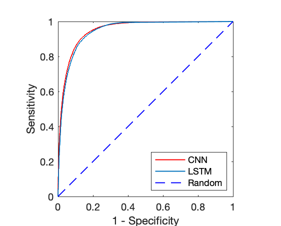
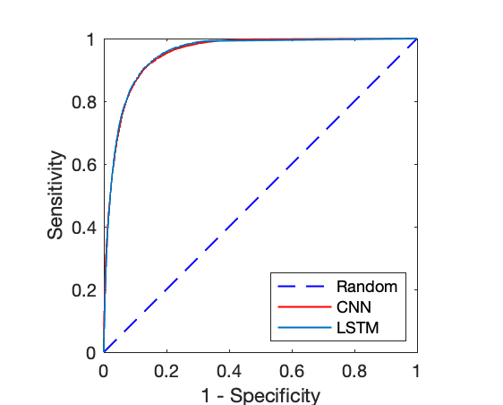
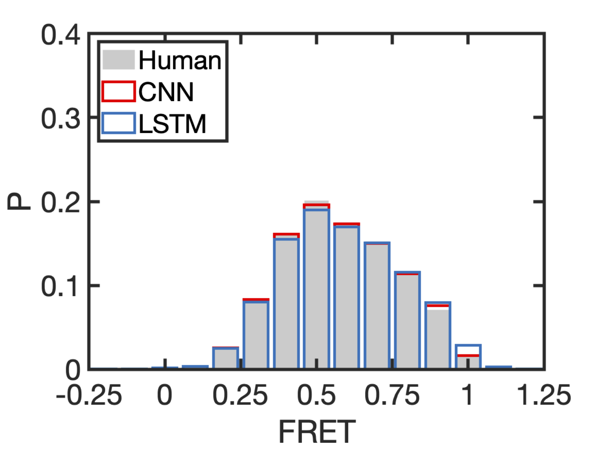
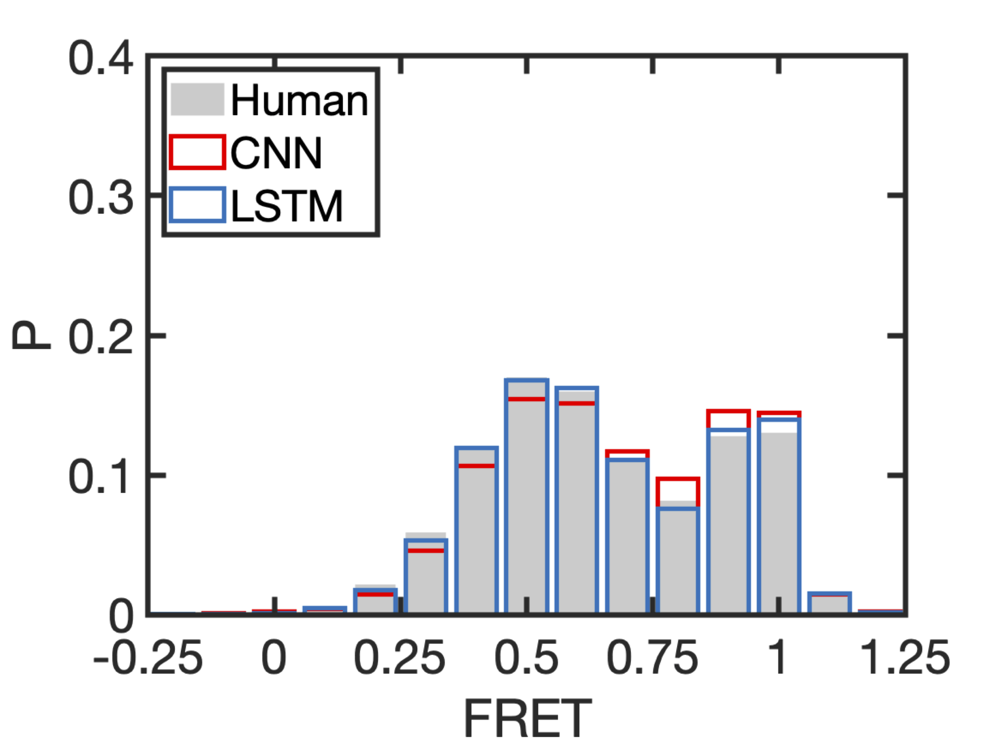
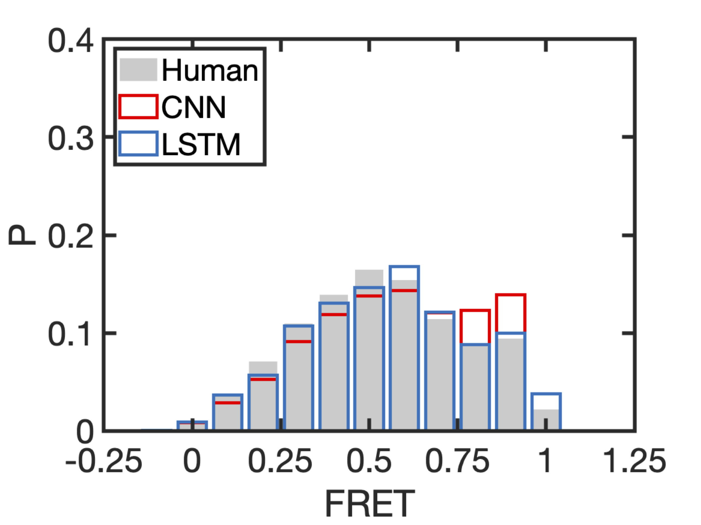

# Double-channel FRET analysis using machine learning

# Experiments

* Experimental Conditions

| Experiments | Training Dataset | Testing Dataset | 
| ----------- | ----------------- | ---------------- | 
| 1-1 to 1-10 |  80% user traces + all simulated traces | 20% user traces |
| 2-1 to 2-10 | 80% user traces | 20% user traces |

* User Traces Statistics

| Experiment System | Accepted Traces | Rejected Traces |
| ---- | ----- | ----- |
| RNA0 | 2050 | 4332 |
| RIB | 2538 | 15688 |
| W3T | 366 | 2896 | 
| HaMMy | 156 | 1369 | 
| Simulation | 5000 | 0 |
| Total | 10110 | 24285 |
## Simple Conv. Neural Net

* Net structure

* Training parameters

| Parameter Name | Value |
| ------------------- | ---- |
| Optimization method | ADAM |
| Learning rate | 0.0001 |
| Training Patience | 5 |
| Param. initializer | GLOROT |

* Testing results

| Expt | Sensitivity | Specificity | Precision | Concordance |
| ---- | ----------- | ----------- | ----------- | ----------- |
| 1-1  | 75.6% | 93.9% | 73.0% | 90.7% | 
| 1-2  | 66.6% | 95.4% | 75.4% | 90.3% | 
| 1-3  | 74.2% | 94.3% | 73.5% | 90.8% |
| 1-4  | 72.6% | 94.8% | 74.4% | 90.9% |
| 1-5  | 81.0% | 93.2% | 71.1% | 91.1% |
| 1-6  | 72.2% | 95.1% | 76.8% | 90.9% |
| 1-7  | 72.2% | 94.4% | 72.6% | 90.7% |
| 1-8  | 70.6% | 94.3% | 72.9% | 90.1% |
| 1-9  | 75.2% | 94.6% | 75.1% | 91.1% |
| 1-10  | 72.3% | 94.6% | 74.4% | 90.7% |
| Average | 73.3%	| 94.5% |	74.0%	| 90.7%| 

| Expt | Sensitivity | Specificity | Precision | Concordance |
| ---- | ----------- | ----------- | ----------- | ----------- |
| 2-1  | 73.5% | 94.6% | 74.8% | 90.8% | 
| 2-2  | 75.9% | 93.9% | 72.9% | 90.8% | 
| 2-3  | 75.2% | 95.0% | 75.8% | 91.2% | 
| 2-4  | 73.0% | 94.5% | 73.5% | 90.8% | 
| 2-5  | 73.2% | 94.5% | 73.4% | 90.9% | 
| 2-6  | 80.1% | 93.5% | 73.5% | 91.1% | 
| 2-7  | 77.0% | 93.8% | 71.5% | 90.9% | 
| 2-8  | 66.0% | 96.5% | 80.5% | 91.1% | 
| 2-9  | 70.4% | 95.1% | 75.9% | 90.7% | 
| 2-10  | 76.2% | 93.8% | 72.7% | 90.7% | 
| Average |74.1%	| 94.5%	| 74.5%| 	90.9%| 

Average training time: 

## AlexNet

## Recursive Neural Net - LSTM

* Net structure

* Training parameters

| Parameter Name | Value |
| ------------------- | ---- |
| Optimization method | ADAM |
| Learning rate | 0.0001 |
| Training Patience | 5 |
| Param. initializer | GLOROT |

* Testing results

| Expt | Sensitivity | Specificity | Precision | Concordance |
| ---- | ----------- | ----------- | ----------- | ----------- |
| 1-1  | 72.0% | 95.2% | 76.6% | 91.1% | 
| 1-2  | 73.1% | 94.4% | 73.7% | 90.6% | 
| 1-3  | 74.0% | 93.6% | 71.2% | 90.2% | 
| 1-4  | 66.6% | 94.7% | 72.4% | 89.8% |
| 1-5  | 63.0% | 96.7% | 80.1% | 91.0% |
| 1-6  | 57.8% | 95.0% | 72.3% | 88.2% |
| 1-7  | 68.4% | 94.1% | 70.3% | 89.8% |
| 1-8  | 76.5% | 94.6% | 75.4% | 91.4% |
| 1-9  | 76.4% | 93.5% | 72.0% | 90.3% |
| 1-10  | 72.0% | 93.8% | 71.5% | 90.0% |
| Average | 70.0% |	94.6%	| 73.6% |	90.2%| 

| Expt | Sensitivity | Specificity | Precision | Concordance |
| ---- | ----------- | ----------- | ----------- | ----------- |
| 2-1  | 74.3% | 93.7% | 72.0% | 90.2% | 
| 2-2  | 75.3% | 94.2% | 73.5% | 90.9% | 
| 2-3  | 73.3% | 95.9% | 79.2% | 91.9% | 
| 2-4  | 70.6% | 96.2% | 79.4% | 91.7% | 
| 2-5  | 76.9% | 94.8% | 75.3% | 91.7% | 
| 2-6  | 65.8% | 96.4% | 80.2% | 90.8% |
| 2-7  | 79.2% | 93.0% | 69.7% | 90.6% |
| 2-8  | 76.8% | 94.4% | 74.9% | 91.3% |
| 2-9  | 58.7% | 97.0% | 81.0% | 90.1% |
| 2-10  | 69.0% | 95.6% | 77.0% | 90.9% |
| Average | 72.0% |	95.1%	| 76.2%	| 91.0%| 

Average training time: 

## Simple-CNN AND(&&) LSTM (Accept if and only if both net accept)
| Expt | Sensitivity | Specificity | Precision | Concordance |
| ---- | ----------- | ----------- | ----------- | ----------- |
| 1-1  | 61.8% | 98.0% | 86.8% | 91.4% | 
| 1-2  |  56.1% | 98.1% | 86.5% | 90.7% | 
| 1-3  |  60.5% | 97.5% | 83.5% | 91.0% | 
| 1-4  |  54.0% | 98.1% | 85.4% | 90.5%% | 
| 1-5  |  56.8% | 98.4% | 88.1% | 91.3% | 
| 1-6  |  47.8% | 98.2% | 85.6% | 88.9% |
| 1-7  |  55.4% | 97.5% | 81.8% | 90.4%% |
| 1-8  |  59.6% | 97.6% | 84.5% | 90.9% |
| 1-9  |  63.0% | 97.5% | 84.7% | 91.3% |
| 1-10  |  59.1% | 97.8% | 85.5% | 91.0% |
| Average |  NA | NA | NA | 89.5%| 

| Expt | Sensitivity | Specificity | Precision | Concordance |
| ---- | ----------- | ----------- | ----------- | ----------- |
| 2-1  |  61.6% | 97.7% | 85.0% | 91.2% | 
| 2-2  |  62.8% | 97.6% | 84.8% | 91.5% | 
| 2-3  |  60.3% | 98.0% | 86.6% | 91.4%% | 
| 2-4  |  58.4% | 98.1% | 86.4% | 91.2% | 
| 2-5  |  62.1% | 97.7% | 85.0% | 91.6% | 
| 2-6  |  58.7% | 97.9% | 86.3% | 90.7%% |
| 2-7  |  66.2% | 96.8% | 80.9% | 91.6% |
| 2-8  |  56.5% | 98.4% | 88.3% | 89.9% |
| 2-9  |  47.1% | 98.8% | 89.4% | 89.5% |
| 2-10  |  59.2% | 97.9% | 86.0% | 91.1% |
| Average | NA | NA | NA | 90.1%| 

## Simple-CNN vs LSTM
| Expt | Sensitivity | Specificity | Precision | Concordance |
| ---- | ----------- | ----------- | ----------- | ----------- |
| 1-1  | NA | NA | NA | 89.9% | 
| 1-2  |  NA | NA | NA | 89.8% | 
| 1-3  |  NA | NA | NA | 89.5% | 
| 1-4  |  NA | NA | NA | 89.1% | 
| 1-5  |  NA | NA | NA | 89.0% | 
| 1-6  |  NA | NA | NA | 88.6% |
| 1-7  |  NA | NA | NA | 89.7% |
| 1-8  |  NA | NA | NA | 89.9% |
| 1-9  |  NA | NA | NA | 89.7% |
| 1-10  |  NA | NA | NA | 89.4% |
| Average |  NA | NA | NA | 89.5%| 

| Expt | Sensitivity | Specificity | Precision | Concordance |
| ---- | ----------- | ----------- | ----------- | ----------- |
| 2-1  |  NA | NA | NA | 89.9% | 
| 2-2  |  NA | NA | NA | 89.7% | 
| 2-3  |  NA | NA | NA | 91.2% | 
| 2-4  |  NA | NA | NA | 90.8% | 
| 2-5  |  NA | NA | NA | 90.5% | 
| 2-6  |  NA | NA | NA | 89.9% |
| 2-7  |  NA | NA | NA | 90.2% |
| 2-8  |  NA | NA | NA | 89.9% |
| 2-9  |  NA | NA | NA | 89.3% |
| 2-10  |  NA | NA | NA | 89.9% |
| Average | NA | NA | NA | 90.1%| 

## Trace Segmentation - LSTM

| Expt | Sensitivity | Specificity | Precision | Concordance |
| ---- | ----------- | ----------- | ----------- | ----------- |
| 1-1  | 83.8% | 96.1% | 49.2% | 95.6% | 
| 1-2  |  NA | NA | NA | NA | 
| 1-3  |  NA | NA | NA | NA |  
| 1-4  |  NA | NA | NA | NA | 
| 1-5  |  NA | NA | NA | NA | 
| 1-6  |  NA | NA | NA | NA | 
| 1-7  |  NA | NA | NA | NA | 
| 1-8  |  NA | NA | NA | NA | 
| 1-9  |  NA | NA | NA | NA | 
| 1-10  |  NA | NA | NA | NA | 
| Average |  NA | NA | NA | NA |  

| Expt | Sensitivity | Specificity | Precision | Concordance |
| ---- | ----------- | ----------- | ----------- | ----------- |
| 2-1  |  86.8% | 95.3% | 45.2% | 94.9% | 
| 2-2  |  NA | NA | NA | NA | 
| 2-3  |  NA | NA | NA | NA |  
| 2-4  |  NA | NA | NA | NA | 
| 2-5  |  NA | NA | NA | NA | 
| 2-6  |  NA | NA | NA | NA | 
| 2-7  |  NA | NA | NA | NA | 
| 2-8  |  NA | NA | NA | NA | 
| 2-9  |  NA | NA | NA | NA | 
| 2-10  |  NA | NA | NA | NA | 
| Average | NA | NA | NA | NA | 

## ROC

| Expt. Cond. | ROC | 
| ----------- | --- |
| Cond. 1 |  |
| Cond. 2 |  |

## Area under the ROC curve (AUC)

| Expt. Cond. | AUC CNN | AUC LSTM
| ----------- | --- | --- | 
| Cond. 1 | 0.95 | 0.95 |
| Cond. 2 | 0.95 | 0.95 |

# Results

Here we show the FRET historam obtained using experiment 1-1 as a illustration of the performance of the algorithms.

| Experiment System | FRET histogram |
| ----------------- | -------------- |
| RNA0-bubble_M50mMKCl | | 
| RIB1 | | 
| W 3T | | 
| HaMMy | | 

# Method

We used a long-short-term memory neural network to classifiy the double-channel single molecule trace signals. Each trace signal is composed of a serial of frames each of which consists a donor intensity and a acceptor intensity. We pre-precess these raw data by normalizing the intensity and grouping consequtive $n_{bin}$ frames of a trace into one raw feature vecotr. We found the concordance plateaues when $n_{bin} \ge 10$, and used $n_{bin} = 10$ throughout our analysis. The LSTM cells are connected bi-directionally in order to increase the concordance of the network prediction  because the prediction of an earlier frame may depend on states of later frames. For example, ** fill in examples**. The structure of the network is shown in figure (**fill in figure**). The network has (**xxx**) parameters, which are randomly initialized using GOLORT method. We train the network using the cross entropy between human label and the network prediction as the error function. We then training the network by minimizing the error function using the ADAM algorithm. All the layers of the network has an initial learning rate of $10^-4$ except the last fully-connected layer, which has an initial learning rate of $10^-3$. When runing on a workstation with **TESLA XX* GPU, the training process on averge takes **xx hours** on the training dataset. The prodiction process takes on average **xx minutes** on the testing dataset with **XX traces**.    

We used another LSTM  neural network for trace segmemtation to learn how human select segments of traces where two or more FRET states are persistent. To this end, we constructed a multi-layer LSTM neural network as shown in figure (**fill in figure**). The extra complexity of the network structure provides higher concordance with human selection compared to the single-layer LSTM network. We followed the same data pre-process procedure and training method as mentioned previsouly. The cross entropy error function is calculated in this case between the true label and the prediction of the network at **each frame** of the grouped trace data. An example of trace segmentation prediction is shown in figure (** fill in figure**)

Beside LSTM neural networks, we also constructed a convolutional neural network to classify single-molecule trace signals by taking advantage of the anti-correlation of donor and acceptor intensities. We first convert the time-series trace data to 2-dimensional images by scatter plotting the donor and acceptor intensity. In each 2-dimensional image, each scatter point means   
