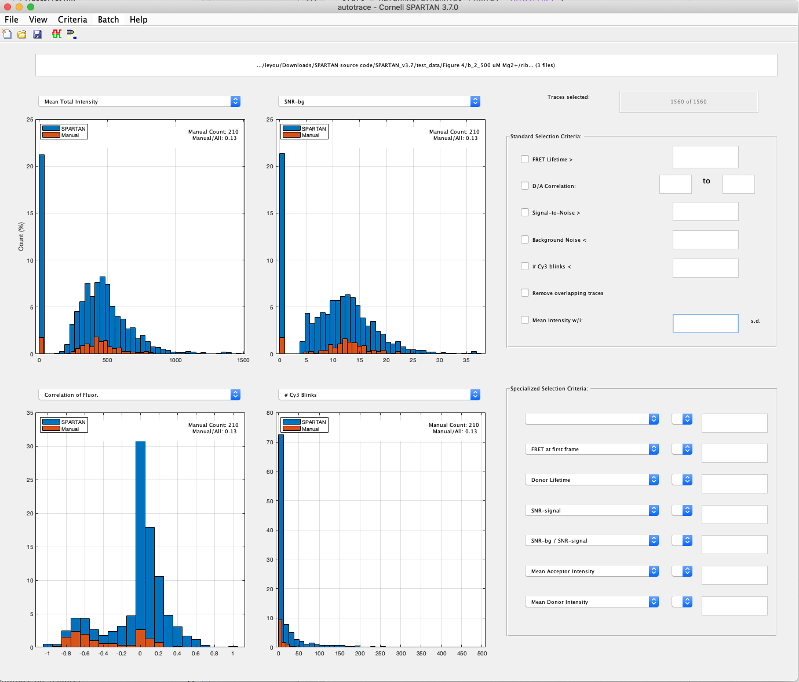

# Trace selection with SPARTAN

In comparison with our LSTM models, we benchmark the performance of SPARTAN's trace sorting functionality. SPARTAN's trace sorting is based on a hard thresholding method using a pre-defined list of calculated trace features such as signal-to-noise ratio and anti-correlahttps://github.com/coldlaugh/single-molecule-trace-selector/pullstion. We will provide the full list of the calculated trace features in the below sections. 

To use SPARTAN. a user of SPARTAN first finds a set of thresholds using pilot experiment data to filter out as much bad traces as possible while maintaining the good traces in the pool. The user can then apply such "curation" thresholds to the bulk of experiment data. The thresholding algorithm is fast, since the trace features are calculated very efficiently (I think). 

After the "curation" step, the user will need to go over the filtered trace pool to select out good traces. There is no automatic selection / segmentation algorithm in SPARTAN for this step.

Here, we use Shiba's data as an example to benchmark the performance of SPARTAN's hard thresholding method.

## Thresholds searching method

We modified the source code of SPARTAN to load in not only the traces data but also our machine learning data set with human selection labels. This enables us to find good thresholds using "training data" to manually search thresholds. Below is an example of the modified SPARTAN trace sorting interface. 

Foe each feature, we can use the histogram shown above find a good threshold by filtering as many traces (blue) as possible while maintaining the manually selected traces (orange).  

## Experiment Results
I have applied the above threshold searching to a dataset from fig5a, and use the thresholds found to the rest of data as evaluation.

### Data Usage
| Figure In Paper | System Description | ML Usage Description | Accepted Trace Counts | Rejected Traces Counts |
| ----- | ------ | ------ |  ---- | ---- |
| Fig.4(b1) | b_1_No M2+_100 uM EDTA | Only used in evaluation | 87  | 1239 |
| Fig.4(b2) | b_2_500 uM Mg2+ | Only used in evaluation| 210 | 1350 |
| Fig.4(b3) | b_3_1 mM Mg2+ | Only used in evaluation| 153 | 828 |
| Fig.5(a1) | a_1 mM Mg2+_100uM Mn2+ | 1 trace file used in transfer training, the rest 3 used in evaluation | 66(train),157(evaluation) | 490(train),1197(evaluation)|
| Fig.5(c)  | c_100 uM Mn2+ only | Only used in evaluation|125 | 1724 |

### Thresholds Used

| Feature | Thresholds |
| ------- | ---------- |
|FRET at first frame |  <1.00 |
|Donor lifetime |  >50.00 |
|SNR-signal | >2.00 |
|SNR-bg/SNR-signal |  >1.50 |
|Mean acceptor intensity |  >60.00 |
|Mean donor intensity |  >30.00 |
|FRET Lifetime |  >25.00 |
| D/A correlation |  >-1.00 |
| D/A correlation | <0.20 |
| Signal-to-noise |  >7.00 |
| Background Noise | <250.00 |
|# Cy3 blinks |  <40.00 |

