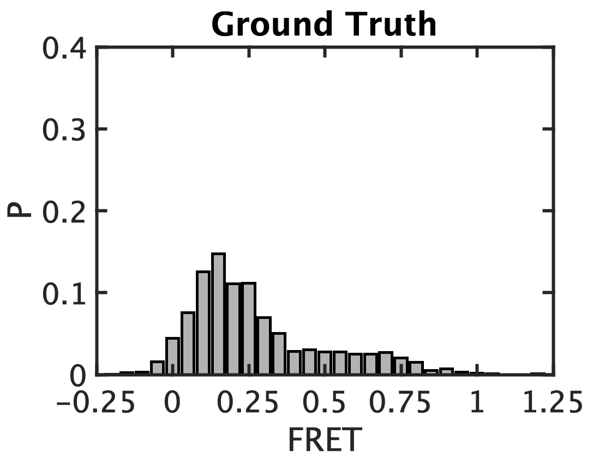

# Transfer Learning Experiment Results
We use transfer learning to demonstrate the capacity of our trained model to generalize to new datasets. In this experiment, we use a new dataset unseen by our trained LSTM models during its training. To apply our model to this new dataset, we use the trained LSTM models as base models, training them on a small portion of the new dataset using transfer learning and evaluate the transfer-learned models using confusion matrices and FRET histograms.

## Description of dataset

| Figure In Paper | System Description | ML Usage Description | Accepted Trace Counts | Rejected Traces Counts |
| ----- | ------ | ------ |  ---- | ---- |
| Fig.4(b1) | b_1_No M2+_100 uM EDTA | Only used in evaluation | 87  | 1239 |
| Fig.4(b2) | b_2_500 uM Mg2+ | Only used in evaluation| 210 | 1350 |
| Fig.4(b3) | b_3_1 mM Mg2+ | Only used in evaluation| 153 | 828 |
| Fig.5(a1) | a_1 mM Mg2+_100uM Mn2+ | 30% used in transfer training, the rest used in evaluation | 69(train),154(evaluation) | 490(train),1197(evaluation)|
| Fig.5(c)  | c_100 uM Mn2+ only | Only used in evaluation|125 | 1724 |

## Transfer Learning How-to

How is transfer learning realized? Firstly, we import base models that have been trained on a large dataset. We then decrease the learning rate dramatically for all layers except the last fully connected layer such that they are locked to their current parameters during the transfer training. Consider the layers before the last fully connected layers as an encoder that extracts time traces' characterics such as anti-correlation, photo-bleach, etc. Consider the last fully connected layer as the trace selection criteria you would set for each characterics. Since the difference between different systems are mainly criteria, we just need our base model to re-learn the last fully connected layer. Therefore transfer learning requires a much smaller training dataset.

## Evaluation Results

We transfer-learned a LSTM classification model and a LSTM segmentation model. Their evaluation results are listed below.

### Concordances

| Figure In Paper | True Positive | False Negative | False Positive | True Negative |  Concordance | 
| --------------- | ------------- | --------------| -------------- | -------------- | ----------  |
| Fig.4(b1) |  30 | 57 | 28 | 1211 | 93.59% |
| Fig.4(b2) | 65 | 145 | 29 | 1321 |  88.85% |
| Fig.4(b3) | 80 | 73  | 25 | 803 |  90.01% |
| Fig.5(a1) | 79 | 75 | 59 | 1138 |  90.08% |
| Fig.5(c) | 57 | 68 | 63 | 1661 | 92.91% |

Note that if we want the model to accept traces more aggresively, and then human select the accepted traces, we can achieve that be giving higher weight to accepted traces in the transfer learning. 

### FRET Histograms

| Figure In Paper | Model Output | Manual Selection |
| --------------- | ------------ | ---------------- |
| Fig.4(b1) |  | |
| Fig.4(b2) |  | |
| Fig.4(b3) |  | |
| Fig.5(a1) |  | |
| Fig.5(c) |  | |

## Conclusion

I've demonstrated that with the power of transfer learning we can apply our deep learning method to new dataset with as few as 69 accepted traces.

